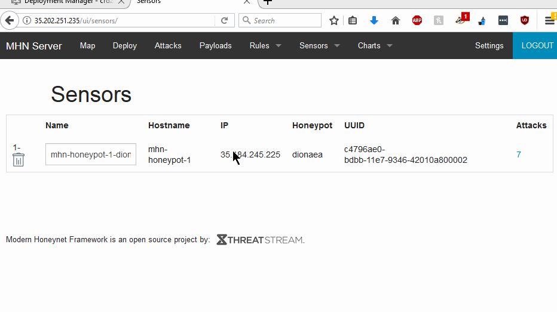
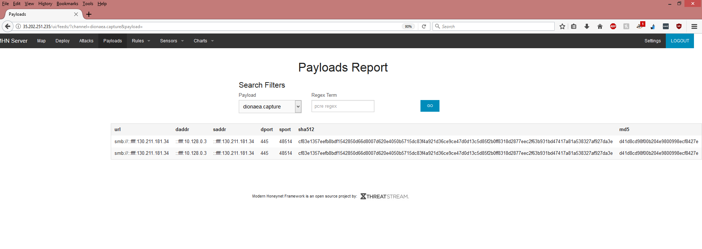

# HoneyPot
# Honeypot Assignment

**Time spent:** **25** hours spent in total

**Objective:** Create a honeynet using MHN-Admin. Present your findings as if you were requested to give a brief report of the current state of Internet security. Assume that your audience is a current employer who is questioning why the company should allocate anymore resources to the IT security team.

### MHN-Admin Deployment (Required)

**Summary:** I used GCP and used mhn-admin Virtual Machine. 

### Dionaea Honeypot Deployment (Required)

**Summary:**Dionaea is a low-interaction honeypot that captures attack payloads and malware. Dionaea is meant to be a nepenthes successor, embedding python as scripting language, using libemu to detect shellcodes, supporting ipv6 and tls.

### Database Backup (Required) 

**Summary:** The RDBMS used is GCP database.  JSON file includes the timestamp, sourceIP, destination port and source port.

*Be sure to upload session.json directly to this GitHub repo/branch in order to get full credit.*

### Deploying Additional Honeypot(s) (Optional)

#### X Honeypot

**Summary:** It identifies attack on the system.

### Malware Capture and Identification (Optional)

#### X Malware

**Summary:** Dionea honeypot was deployed to find the attacks. 

MD5 Hash: *Run `md5sum` on the file and record the hash here.*

SHA1 Hash: *Run `sha1sum` on the file and record the hash here.*

## Notes

Describe any challenges encountered while doing the assignment.
Incorrect commands caused issues in deployment. Hours to find an attack was a challenge.

